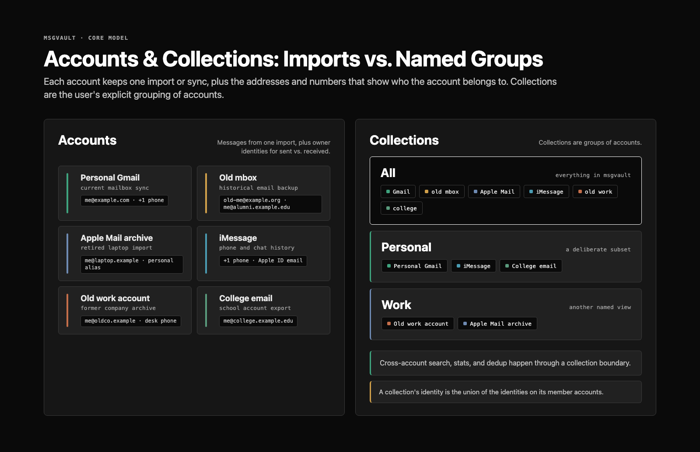
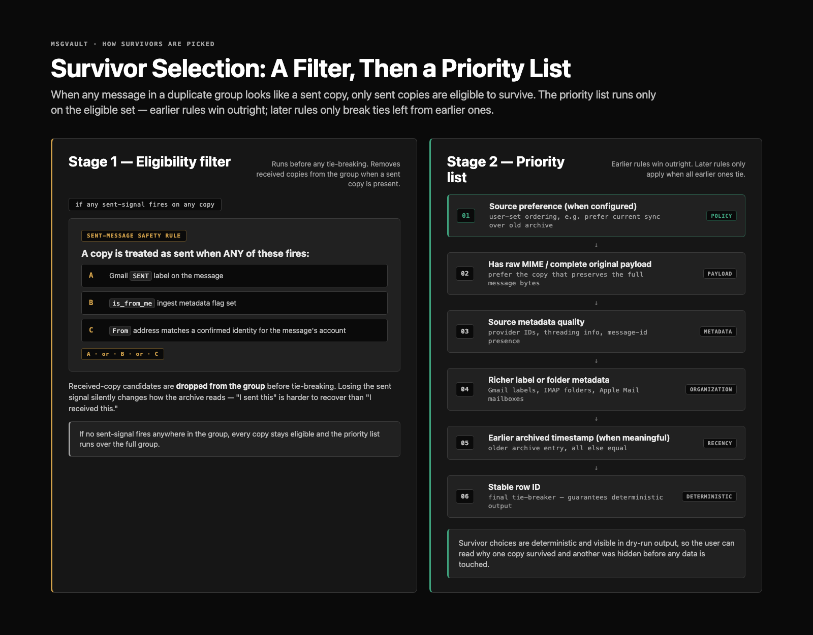
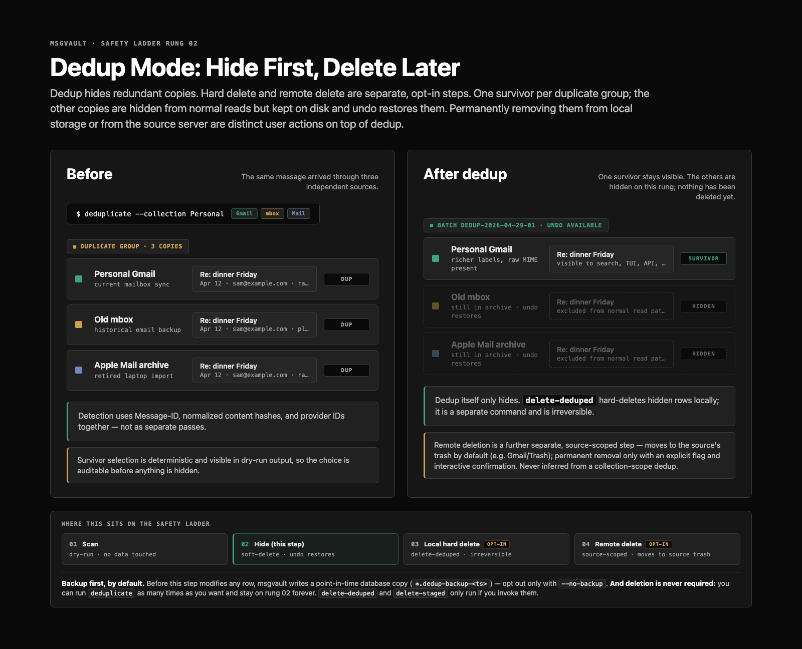
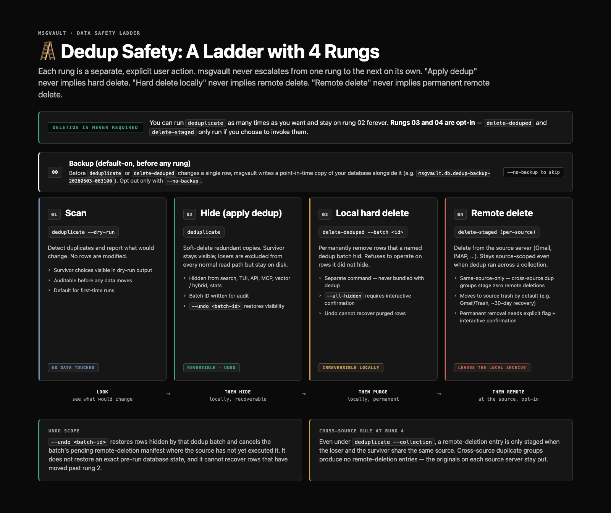

# Accounts, Identities, Collections, and Deduplication — Specification

This is the authoritative reference for how msgvault organizes
ingested communications, identifies which messages belong to whom,
and removes redundant local copies without destroying the underlying
archive. It defines the conceptual model, the schema, the CLI
surface, the read-side contract, the manifest formats, and the
errors that implementations must produce.

If a code change disagrees with this document, one of them is wrong.
Open a PR against either to reconcile.

## Order of introduction: Account, Identity, Collection (AIC)

We always introduce the data model in the order **Account, Identity,
Collection** — AIC. The order is not cosmetic. It tracks the
dependency chain.

- **Account** is the atomic unit. One ingest source, with no
  reference to any other concept. Every other piece of the model
  depends on it.
- **Identity** is per-account. The question "who am I in this
  source?" only makes sense once an account exists to ask it
  about. Identity reads as a property of an account.
- **Collection** is a grouping of accounts. It composes accounts and
  inherits the union of their identities. Collections only make
  sense once both halves are in place.

Reverse the order and the definitions wobble. "A collection is a
named group of accounts" with no account defined yet is a forward
reference. "An identity belongs to an account" introduced after
collections invites the wrong first question — whether collections
have their own identity — before the right one: whose addresses
count as "me" here?

Code, prose, diagrams, and CLI help text introduce the model in AIC
order. Deduplication arrives last, because it operates over the
model the first three concepts define.

## Reading order

| Section                                                                 | What it specifies                                                |
| ----------------------------------------------------------------------- | ---------------------------------------------------------------- |
| [Conceptual model](#conceptual-model)                                   | Account, Identity, Collection (AIC), `All`                       |
| [Scope semantics](#scope-semantics)                                     | `--account` / `--collection`, name-conflict rules                |
| [Identity model](#identity-model)                                       | Per-account confirmed identifiers, signal sets, comparison rules |
| [Deduplication model](#deduplication-model)                             | Detection, survivor selection, sent-message eligibility filter   |
| [Data safety ladder](#data-safety-ladder)                               | Rungs 00–04, escalation rules, `--no-backup`                     |
| [Live-message contract](#live-message-contract)                         | The `LiveMessagesWhere` predicate and where it applies           |
| [Remote deletion model](#remote-deletion-model)                         | Same-source rule, manifest format, env-var release guardrail     |
| [Undo model](#undo-model)                                               | What undo restores, what it does not                             |
| [Schema](#schema)                                                       | DDL for `collections`, `account_identities`, `applied_migrations`, message-row dedup columns |
| [CLI surface](#cli-surface)                                             | Every command and flag, with mutual-exclusion rules and defaults |
| [Backup behavior](#backup-behavior)                                     | When backup runs, where it writes, opt-out                       |
| [Batch identifiers](#batch-identifiers)                                 | Format and uniqueness rules for dedup-batch IDs                  |
| [Error catalog](#error-catalog)                                         | Verbatim error strings the CLI emits                             |
| [Migration semantics](#migration-semantics)                             | Legacy `[identity]` config → per-account records                 |
| [Cache and index policy](#cache-and-index-policy)                       | What "filtering is the contract" means                           |
| [Scope review checklist](#scope-review-checklist)                       | What to verify before merging changes that touch this area       |

## Conceptual model

The model has three concepts, introduced in AIC order: Account,
Identity, Collection. `All` is named separately as the default
collection that ships pre-built. Deduplication operates over all
three and is specified in its own section below.

### Account

An **account** is one ingested message source/archive. It is the
smallest durable provenance unit in msgvault. One Gmail sync source.
One IMAP source. One mbox import. One Apple Mail import. One iMessage
import. One SMS import. One Facebook Messenger import. One
meeting-transcript import source.

The same real-world mailbox imported through Gmail sync and later
through an old mbox export creates two accounts. They may represent
the same human mailbox. They are distinct archives with distinct
provenance and distinct source-specific deletion semantics.

msgvault never infers that two imports belong together because an
email address, display name, or message content overlaps.

### Identity

An **identity** belongs to an account. It is the set of addresses,
phone numbers, or other protocol-specific identifiers that mean "me"
in that source. A **confirmed identity** means messages from that
address or identifier can be treated as "from me" within that
account's context.

Identity is account-scoped because the same address can appear in
multiple imports — one address is "me" in one source and not in
another. A global identity list collapses that distinction. The
[Identity model](#identity-model) section below specifies the
discovery signals, comparison rules, and storage shape.

### Collection

A **collection** is a named grouping of accounts. It is the user's
explicit statement that multiple sources should be viewed or operated
on together. Examples: `All`, `work`, `personal`, `old laptop
imports`, `gmail plus exports`, `family messages`.

Collections are many-to-many. An account can belong to multiple
collections. A collection can contain multiple accounts. A collection
contains account/source IDs, not other collections.

Collections are the boundary for cross-account features. To search,
count, deduplicate, or export across two independent archives, the
user puts them in a collection.

A collection's identity is the union of confirmed identities from its
member accounts, computed at read time. It is not a separately stored
object.

### `All`

`All` is the default collection containing every account/source.
msgvault creates and maintains it automatically. It is still a
collection. Operations against `All` are collection-scoped operations
and the CLI reports them that way.

`All` is immutable through the CLI. msgvault rejects
`collection delete All` and explicit membership edits on `All`. New
accounts join `All` automatically when they are created.



## Scope semantics

The user-facing scope vocabulary is small.

| Scope            | Meaning                                                 |
| ---------------- | ------------------------------------------------------- |
| Account scope    | One source/archive.                                     |
| Collection scope | All member accounts of one collection.                  |
| All scope        | Every source/archive. The `All` collection is the model's named handle for this set; implementations may resolve it through the collection record or by omitting the source-id filter, provided membership equivalence holds. |

CLI flags expose those boundaries directly.

| Flag                        | Resolves to                                             |
| --------------------------- | ------------------------------------------------------- |
| `--account <account>`       | Exactly one account/source.                             |
| `--collection <collection>` | Exactly one collection.                                 |
| (omitted, where supported)  | The command's documented default — typically per-account iteration for dedup, or `All` for search and browse. |

`--account` and `--collection` are mutually exclusive. Implementations
must enforce this at the cobra layer, not at runtime.

### Name-conflict rules

A collection name and an account identifier can collide. The
resolver rejects each form against the wrong flag with a hint:

- If `work` is a collection, `--account work` returns
  `"work" is a collection, not an account; use --collection work`.
- If `alice@example.com` is an account, `--collection alice@example.com`
  returns `"alice@example.com" is an account, not a collection; use --account alice@example.com`.
- If `--account` matches no source and no collection,
  `no account found for "<input>" (try 'msgvault list-accounts')`.
- If `--collection` matches no collection and no source,
  `no collection named "<input>" (try 'msgvault collection list')`.
- If `--account <input>` matches multiple sources by identifier or
  display name,
  `ambiguous account "<input>" matches multiple sources: [<list>]`.

The full verbatim catalog is in [Error catalog](#error-catalog).

## Identity model

The [Conceptual model](#conceptual-model) introduces identity. This
section specifies the implementation: which signals confirm an
identity, how identifiers compare, and how the collection-level
union resolves at read time.

A collection's identity surfaces through `GetIdentitiesForScope` (or
equivalent) when running scoped operations. It is the union of
confirmed identities from member accounts, computed at read time, not
a separately stored object.

### Discovery signals

Confirmed identifiers carry a `source_signal` field that records
which signals confirmed them. A confirmed identifier may carry one or
more of:

- `is_from_me` — ingest metadata flagged the message as sent by the
  account owner.
- `sent-folder` / `sent-label` — the message was found in a
  sent-mail folder or had a Gmail `SENT` label.
- `account-identifier` — the address matches the account's primary
  identifier (e.g. the Gmail address itself).
- `oauth` — OAuth or provider account metadata named the address.
- `manual` — the user added the identifier interactively via
  `identity add`.
- `config_migration` — the identifier was inserted by the one-time
  migration that promotes a legacy `[identity]` config block into
  per-account records. Distinct from `manual` so `identity list` can
  show provenance accurately.

Signals are stored as a sorted comma-separated set in
`account_identities.source_signal` (e.g. `account-identifier,manual`).
An identity gains signals over time as new evidence appears; signals
are never removed except by `identity remove`.

Global identity configuration is not part of the model. Legacy
`[identity]` config is migrated once on upgrade — see
[Migration semantics](#migration-semantics).

### Identifier comparison

Email-shaped identifiers compare case-insensitively for the local
part and the domain. Other identifiers (phone numbers, account
strings) compare exactly. Phone numbers are stored in normalized
E.164 form (`+1...`), which the CLI applies on `identity add`.

## Collection behavior

Required:

- `All` is created and maintained automatically.
- Users can create named collections from accounts.
- Users can add and remove accounts from collections.
- Collection membership accepts only accounts/sources.
- Collection views preserve account provenance.

Out of scope:

- Nested collections.
- Implicit collection creation from matching email addresses.
- Treating a collection as an account.

## Deduplication model

Deduplication removes redundant local copies from normal user-facing
results without destroying the underlying archive.

### Valid scopes

| Invocation                              | Boundary                                                    |
| --------------------------------------- | ----------------------------------------------------------- |
| `deduplicate --account <account>`       | Compare messages only within that account/source.           |
| `deduplicate --collection <collection>` | Compare messages across member accounts in that collection. |
| `deduplicate`                           | Process each account independently, in iteration.           |

The unscoped form is per-account cleanup. It does not compare all
messages across all accounts as one global set.

The unscoped default is per-account iteration rather than
`--collection All` because cross-account dedup is the higher-risk
operation. It can collapse duplicates between independent archives
whose provenance the user may want to preserve. Cross-account dedup
requires explicit `--collection`. To dedup across every account,
write `--collection All`.

### Detection

Duplicate detection uses multiple signals:

- RFC822 `Message-ID` header (`messages.rfc822_message_id`).
- Normalized raw MIME or body content hash.
- Provider/source message IDs where appropriate
  (`messages.source_message_id`).
- Attachment content hashes where relevant.

Detection runs in two passes:

1. **Message-ID pass.** Group messages by RFC822 Message-ID. Each
   distinct ID forms one duplicate group.
2. **Content-hash pass.** Among the messages that survive the
   Message-ID pass (i.e., excluding identified losers), group by
   normalized content hash. Messages without a Message-ID and
   Message-ID survivors are both eligible — they may form
   content-hash groups together when their normalized payloads
   match.

The two passes are sequential, not transitively unioned. A
content-hash group with two Message-ID survivors keeps both as
winners (one per Message-ID group). A future revision may treat
every signal as a transitive-union surface; today's behavior is
sequential.

### Survivor selection

Survivor selection is deterministic and explainable. Two stages run
in order.

**Stage 1 — eligibility filter.** When any message in a duplicate
group looks like a sent copy, only sent copies are eligible to
survive. Received-copy candidates drop from the group before
tie-breaking. A message looks like a sent copy when any of the
following fires (OR):

- a Gmail `SENT` label on the message.
- an `is_from_me` flag on the message from ingest metadata.
- the `From` address matches a confirmed identity for the message's
  account (case-insensitive for email-shaped identifiers).

This is an eligibility filter, not a tie-breaker. Letting a received
copy win on payload richness silently changes how the archive reads.
"I sent this" is harder to recover from data than "I received this."

**Stage 2 — priority list.** Within the eligible set, survivor
preference runs in this order:

1. Source preference (when `--prefer` is configured, or the default
   order: `gmail,imap,mbox,emlx,hey`).
2. Has raw MIME / complete original payload.
3. Source metadata quality — provider IDs, threading info, presence
   of Message-ID.
4. Richer label or folder metadata.
5. Earlier `archived_at` timestamp (when meaningful).
6. Stable row ID, as the final tie-breaker.

Earlier rules win outright. Later rules apply only when all earlier
ones tie. The exact policy is visible in dry-run output.



### Effects of applying dedup

A successful `deduplicate` run:

- Chooses one survivor per duplicate group.
- Hides redundant local rows by setting `messages.deleted_at` and
  `messages.delete_batch_id`.
- Unions labels from non-survivors onto the survivor.
- Backfills the survivor's raw MIME if a non-survivor had it and the
  survivor did not.
- Writes the batch ID to a manifest entry for audit and undo.
- Stages remote-deletion manifest entries only when explicitly
  requested via `--delete-dups-from-source-server` AND the loser
  and survivor share a `source_id`.

Dedup does not silently escalate from local hiding to local hard
deletion or remote deletion.



## Data safety ladder

We call the design the **dedup safety ladder**: four explicit rungs
the user climbs deliberately, plus a rung-zero backup that runs by
default.

**Deletion is never required.** A user can run `deduplicate` as many
times as they want and stay on rung 02 forever. Rungs 03 and 04 are
opt-in and only run if the user invokes a different command.

Each rung is a separate, explicit user action. msgvault never
escalates from one rung to the next on its own. "Apply dedup" never
implies hard delete. "Hard-delete locally" never implies remote
delete. "Remote delete" never implies permanent remote delete.

| Rung | Action              | Command                          | Reversibility                      |
| ---- | ------------------- | -------------------------------- | ---------------------------------- |
| 00   | Backup (default-on) | (automatic before 02 and 03)     | n/a — produces a recoverable file  |
| 01   | Scan                | `deduplicate --dry-run`          | no data touched                    |
| 02   | Hide (apply dedup)  | `deduplicate`                    | reversible via `--undo <batch-id>` |
| 03   | Local hard delete   | `delete-deduped --batch <id>`    | irreversible locally               |
| 04   | Remote delete       | `delete-staged` (per-source)     | leaves the local archive           |

**Rung 00 — Backup.** Before `deduplicate` or `delete-deduped`
modifies any row, msgvault writes a point-in-time copy of the
database. See [Backup behavior](#backup-behavior). Scan (rung 01)
modifies no rows and triggers no backup.

**Rung 01 — Scan.** `deduplicate --dry-run` detects duplicates and
reports what would change. No rows are modified. Survivor choices
are visible in the output. The result is auditable before any data
moves.

**Rung 02 — Hide.** `deduplicate` applies the scan. Pruned copies
are soft-deleted: hidden from normal reads, kept on disk.
`--undo <batch-id>` restores visibility.

**Rung 03 — Local hard delete.** `delete-deduped` permanently
removes hidden rows from the local archive. By default it acts on
named batches via `--batch <id>` and refuses to operate on rows it
didn't hide. The `--all-hidden` form purges every hidden row and
requires interactive confirmation. Backup runs again before the
purge unless `--no-backup` is set. Undo cannot recover purged rows.

**Rung 04 — Remote delete.** `delete-staged` deletes from the source
server. Same-source-only — see [Remote deletion model](#remote-deletion-model).
The default action moves messages to the source's trash. Permanent
removal requires `--permanent` and an interactive confirmation that
checks for the literal word `delete`.

Attachment dedup is independent of message dedup. Attachments live
in a content-addressed pool, so identical files are stored once
regardless of how many messages reference them. Hiding or
hard-deleting a duplicate message does not delete the underlying
attachment blob unless no remaining message references it.



## Live-message contract

A **live message** is a row that has not been locally hidden by
dedup and has not been recorded as deleted from the source server.
The term is internal vocabulary for this contract. It appears in
implementation slices and code as the `LiveMessagesWhere` predicate.

Normal user-facing reads return live messages only.

The contract applies to:

- Message search (FTS5, deep search).
- Vector and hybrid search.
- TUI browsing and drill-downs.
- Stats and aggregates.
- API responses.
- MCP responses.
- Exports that claim to represent the visible archive.

### The `LiveMessagesWhere` predicate

`LiveMessagesWhere(alias, hideDeletedFromSource)` returns a SQL
fragment that filters out non-live rows. The two flag values are:

| `hideDeletedFromSource` | Filters out rows where                                         |
| ----------------------- | -------------------------------------------------------------- |
| `false`                 | `deleted_at IS NOT NULL` (dedup-hidden only)                   |
| `true`                  | `deleted_at IS NOT NULL` OR `deleted_from_source_at IS NOT NULL` |

The `alias` argument is the table alias the query uses for
`messages` (most commonly `m` or `msg`; pass `""` for unaliased
references).

Every read path constructs its WHERE clause through this predicate.
Implementations must not inline the comparison.

Indexes and caches may lag behind canonical SQLite state. Normal
retrieval still filters through `LiveMessagesWhere`. Rebuilding
derived surfaces is operational hygiene; it is not the only thing
keeping hidden duplicates out of results.

### Query scope is consistent across backends

| Scope            | Source-ID set passed into the predicate              |
| ---------------- | ---------------------------------------------------- |
| Account scope    | One source ID.                                       |
| Collection scope | The set of source IDs in `collection_sources`.       |
| All scope        | Every source ID (resolved from the `All` collection). |

Backend differences are acceptable for ranking or performance. They
are not acceptable for scope membership or live-message visibility.

## Remote deletion model

Remote deletion is a separate operation from local dedup. Even when
duplicate detection runs across a collection, remote deletion
decisions remain source-specific.

### Rules

- **Same-source constraint.** A remote-deletion entry is staged only
  when the loser and the survivor share a `source_id`. Cross-source
  duplicate groups produce no remote-deletion entries even when the
  dedup scope is a collection that spans those sources.
- **Source-scoped manifests.** Manifest filenames and reporting
  labels reflect the source, never the collection name, even when
  dedup was invoked under `--collection`.
- **Move to source trash by default.** Where the source supports a
  recoverable trash state (e.g. Gmail's ~30-day Gmail/Trash), the
  default remote-deletion behavior moves messages there.
- **Permanent deletion is opt-in.** Permanent remote deletion
  requires `--permanent` and interactive confirmation. It is never
  the default, never inferred from dedup, and never applied in batch
  without the user acknowledging the source and scope at the moment
  of the action.
- **Release guardrail.** The destructive `delete-staged` execute
  path is gated behind the environment variable
  `MSGVAULT_ENABLE_REMOTE_DELETE=1` for the v1 release. Read-only
  modes (`--list`, `--dry-run`, `list-deletions`, `show-deletion`)
  are always permitted. The gate is independent of `--permanent`.
  Removal of the guardrail is a future release decision.

### Manifest format

`Manager` writes one JSON manifest per deletion batch under
`~/.msgvault/deletions/<status>/<batch-id>.json`, where `<status>`
is one of `pending`, `in_progress`, `completed`, `cancelled`,
`failed`. Status transitions move the file between subdirectories.

```json
{
  "version": 1,
  "id": "<batch-id>",
  "created_at": "2026-05-03T16:45:00Z",
  "created_by": "cli",                 // "tui" | "cli" | "api"
  "description": "dedup batch dedup-...",
  "filters": { /* source-specific filter restoration */ },
  "summary": { /* counts, per-sender breakdown */ },
  "gmail_ids": ["<source_message_id>", "..."],
  "status": "pending",                 // pending | in_progress | completed | cancelled | failed
  "execution": null                    // populated after delete-staged runs
}
```

`gmail_ids` is the source-scoped list of provider IDs to delete.
It is named `gmail_ids` for historical reasons; for IMAP sources it
holds the provider's UID. A future revision may rename it.

`Manifest.Version` is `1`. A later schema bump will increment it and
implementations must reject mismatches with a clear error.

The on-disk directory location (`<status>/<batch-id>.json`) is the
spec-authoritative state for a manifest. The inline `status` field is
convenience metadata that should match the directory; implementations
should update it before moving the file. A future revision may
declare directory-as-truth and reduce `status` to a derived field —
implementations should not treat the inline value as load-bearing on
disagreement.

## Undo model

Undo is not full time travel.

`--undo <batch-id>` restores rows hidden by that dedup batch by
clearing `deleted_at` and `delete_batch_id` on every row whose
`delete_batch_id` matches. It also cancels the batch's pending
remote-deletion manifest where the source has not yet executed it.

`--undo` does not:

- Reverse survivor label unioning.
- Reverse raw-MIME enrichment from non-survivors onto the survivor.
- Restore derived-index state. Indexes catch up on the next rebuild.
- Recover rows the user has since purged through `delete-deduped`.
- Reverse remote deletions already executed against a source.

Implementations must surface this gap in the user-facing
`--undo` output text, not bury it in documentation.

`--undo` is repeatable: passing multiple `--undo <id>` flags is an
ordered sequence of independent undos. Failures on one batch do not
skip later batches and errors are aggregated. `--undo` is mutually
exclusive with `--account`, `--collection`, and `--dry-run`.

## Schema

This section is the canonical schema reference. Identifier types are
SQLite; PostgreSQL definitions in `schema.sql` follow the same
shape with dialect-appropriate types.

### Sources (account ingest unit)

Defined in the broader `schema.sql`. Relevant columns for this spec:

```sql
CREATE TABLE IF NOT EXISTS sources (
    id           INTEGER PRIMARY KEY,
    source_type  TEXT NOT NULL,    -- 'gmail', 'imap', 'mbox', 'emlx', ...
    identifier   TEXT NOT NULL,    -- email, phone number, account ID
    display_name TEXT,
    -- ... sync state, oauth_app, timestamps ...
    UNIQUE(source_type, identifier)
);
```

### Collections

```sql
CREATE TABLE IF NOT EXISTS collections (
    id          INTEGER PRIMARY KEY,
    name        TEXT NOT NULL UNIQUE,
    description TEXT NOT NULL DEFAULT '',
    created_at  DATETIME NOT NULL DEFAULT CURRENT_TIMESTAMP
);

CREATE TABLE IF NOT EXISTS collection_sources (
    collection_id INTEGER NOT NULL REFERENCES collections(id) ON DELETE CASCADE,
    source_id     INTEGER NOT NULL REFERENCES sources(id)     ON DELETE CASCADE,
    PRIMARY KEY (collection_id, source_id)
);

CREATE INDEX IF NOT EXISTS idx_collection_sources_source_id
    ON collection_sources(source_id);
```

The `All` collection is a row in `collections` with name `All`. It
is auto-managed by store bootstrap. CLI mutations on it return
`ErrCollectionImmutable`.

### Account identities

```sql
CREATE TABLE IF NOT EXISTS account_identities (
    source_id     INTEGER NOT NULL REFERENCES sources(id) ON DELETE CASCADE,
    address       TEXT NOT NULL,            -- case-preserved
    source_signal TEXT NOT NULL DEFAULT '', -- sorted comma-separated signal set
    confirmed_at  DATETIME NOT NULL DEFAULT CURRENT_TIMESTAMP,
    PRIMARY KEY (source_id, address)
);

CREATE INDEX IF NOT EXISTS idx_account_identities_address
    ON account_identities(address);
```

`address` preserves case as the user entered it. Comparison uses
`identifierMatch` (case-insensitive for email-shaped identifiers,
exact otherwise).

### Dedup soft-delete columns on `messages`

The `messages` table carries three columns that this feature uses:

```sql
deleted_at             DATETIME,    -- set when dedup hides the row
deleted_from_source_at DATETIME,    -- set when delete-staged executes against a source
delete_batch_id        TEXT         -- ties hidden rows to their dedup batch
```

`deleted_at IS NULL` is the local-hide gate. `deleted_from_source_at
IS NULL` is the remote-deletion gate. The `LiveMessagesWhere`
predicate combines them.

### Applied migrations

```sql
CREATE TABLE IF NOT EXISTS applied_migrations (
    name       TEXT PRIMARY KEY,
    applied_at DATETIME NOT NULL DEFAULT CURRENT_TIMESTAMP
);
```

DDL changes use `IF NOT EXISTS`. This table records *data*
migrations that must run exactly once (e.g.
`legacy_identity_to_per_account`).

## CLI surface

This section is the source of truth for command names and flags.
Long-form flag names are stable; short forms are noted where they
exist. Defaults are the literal in-code defaults.

### `msgvault deduplicate`

Find duplicate messages and (with `--undo`) reverse a previous run.

| Flag                                | Type      | Default                       | Notes                                                              |
| ----------------------------------- | --------- | ----------------------------- | ------------------------------------------------------------------ |
| `--dry-run`                         | bool      | `false`                       | Scan and report only.                                              |
| `--no-backup`                       | bool      | `false`                       | Skip the pre-execute database backup.                              |
| `--prefer <list>`                   | string    | (none)                        | Source-type preference order for survivor selection. When the flag is empty, implementations fall back to the documented default order: `gmail,imap,mbox,emlx,hey`. The fall-through gives a single source of truth for the default — implementations should not register the literal default string as the cobra-layer default. |
| `--content-hash`                    | bool      | `false`                       | Run the second-pass content-hash detection.                        |
| `--undo <batch-id>` (repeatable)    | string... | (none)                        | Reverse one or more named batches.                                 |
| `--account <name>`                  | string    | (none)                        | Per-source scope.                                                  |
| `--collection <name>`               | string    | (none)                        | Cross-source scope inside one collection.                          |
| `--delete-dups-from-source-server`  | bool      | `false`                       | DESTRUCTIVE: stage pruned duplicates for remote deletion. Execution still requires `MSGVAULT_ENABLE_REMOTE_DELETE=1`. |
| `--yes` / `-y`                      | bool      | `false`                       | Skip the confirmation prompt.                                      |

Mutually exclusive flag pairs (enforced at the cobra layer):

- `--account` ⊕ `--collection`
- `--dry-run` ⊕ `--undo`
- `--undo` ⊕ `--account`
- `--undo` ⊕ `--collection`
- `--undo` ⊕ `--delete-dups-from-source-server`

Unscoped invocation iterates over every account in isolation. It
never crosses source boundaries.

### `msgvault delete-deduped`

Permanently remove rows that a named dedup batch hid (rung 03).

| Flag                                | Type      | Default       | Notes                                              |
| ----------------------------------- | --------- | ------------- | -------------------------------------------------- |
| `--batch <id>` (repeatable)         | string... | (none)        | Named batches to purge. Refuses unrelated rows.    |
| `--all-hidden`                      | bool      | `false`       | Purge every hidden row across all batches.         |
| `--no-backup`                       | bool      | `false`       | Skip the pre-execute database backup.              |
| `--yes` / `-y`                      | bool      | `false`       | Skip the confirmation prompt.                      |

`--all-hidden` always requires interactive confirmation (the `-y`
shortcut does not bypass it). Without `--batch` or `--all-hidden`,
the command errors with `must specify --batch or --all-hidden`.

### `msgvault collection`

| Subcommand                                          | Notes                                                                                       |
| --------------------------------------------------- | ------------------------------------------------------------------------------------------- |
| `collection create <name> --accounts <a,b,c>`       | Create a new collection with the given members. Rejects `name = All` with `ErrCollectionImmutable`. |
| `collection list`                                   | List every collection with member counts.                                                   |
| `collection show <name>`                            | Show collection details and members.                                                        |
| `collection add <name> --accounts <a,b,c>`          | Add accounts to a collection. Rejects `name = All`.                                         |
| `collection remove <name> --accounts <a,b,c>`       | Remove accounts from a collection. Rejects `name = All`.                                    |
| `collection delete <name>`                          | Delete a collection. Rejects `name = All`. Underlying sources and messages stay untouched.  |

### `msgvault identity`

| Subcommand                                          | Notes                                                                                       |
| --------------------------------------------------- | ------------------------------------------------------------------------------------------- |
| `identity list`                                     | List confirmed identifiers across one or more accounts. Accepts `--account` / `--collection`. |
| `identity show <account>`                           | Show one account's identity in detail, including signal sets.                               |
| `identity add <account> <identifier>`               | Add a confirmed identifier with `manual` signal.                                            |
| `identity remove <account> <identifier>`            | Remove a confirmed identifier. Returns the rows-affected count.                             |

### `msgvault list-deletions` / `show-deletion` / `cancel-deletion` / `delete-staged`

| Command                              | Notes                                                                                            |
| ------------------------------------ | ------------------------------------------------------------------------------------------------ |
| `list-deletions`                     | List pending and recent deletion batches. Always permitted regardless of the env-var guardrail.  |
| `show-deletion <batch-id>`           | Show one batch's manifest. Read-only; permitted regardless of the guardrail.                     |
| `cancel-deletion [batch-id] [--all]` | Cancel pending or in-progress batches. `--all` cancels every pending or in-progress batch.       |
| `delete-staged [batch-id]`           | Execute pending remote deletions. Gated behind `MSGVAULT_ENABLE_REMOTE_DELETE=1`.                |

`delete-staged` flags:

| Flag                | Type   | Default | Notes                                                                                       |
| ------------------- | ------ | ------- | ------------------------------------------------------------------------------------------- |
| `--permanent`       | bool   | `false` | DESTRUCTIVE: permanent deletion via batch API. Cannot combine with `--yes`.                 |
| `--yes` / `-y`      | bool   | `false` | Skip non-permanent confirmation. Has no effect when `--permanent` is set.                   |
| `--dry-run`         | bool   | `false` | Show what would be deleted; never call the source API.                                      |
| `--list` / `-l`     | bool   | `false` | List staged batches without executing.                                                      |
| `--account <name>`  | string | (none)  | Required when multiple accounts have pending batches and the manifest does not name one.    |

Permanent deletion requires the literal word `delete` typed at the
confirmation prompt. `y` is not enough.

### `msgvault search`, `msgvault stats`, `msgvault tui`

These commands accept the scope flags symmetrically:

- `--account <name>` — one account.
- `--collection <name>` — one collection.
- (omitted) — defaults to `All` for read commands.

`--account` and `--collection` are mutually exclusive. The same
name-conflict resolver runs as for `deduplicate`.

## Backup behavior

Before any rung that modifies data (rungs 02 and 03), msgvault
writes a point-in-time copy of the database alongside the live DB
file.

### Naming

| Command           | Filename pattern                                                       |
| ----------------- | ---------------------------------------------------------------------- |
| `deduplicate`     | `<dbpath>.dedup-backup-<yyyymmdd-hhmmss>`                              |
| `delete-deduped`  | `<dbpath>.delete-deduped-backup-<yyyymmdd-hhmmss>`                     |

`<dbpath>` is the active database path. The timestamp uses the local
time zone in the format `20060102-150405`.

### Mechanism

Backup uses SQLite's `VACUUM INTO` to produce a point-in-time
consistent copy. Implementations must reject non-file DSNs (e.g.
`postgres://`) up front rather than at the first backup attempt.

### Opt-out

`--no-backup` on either command suppresses the backup. The flag does
not affect any other behavior.

### Lifecycle

msgvault never deletes a backup file. Disk-space management is the
user's responsibility. A future release may add a `--prune-backups`
helper.

## Batch identifiers

Dedup batches are identified by a string of the form:

```
dedup-<timestamp>-<source-id>-<sanitized-identifier>-<random-token>
```

Components:

- `<timestamp>` — local time, format `20060102-150405`.
- `<source-id>` — integer primary key from `sources`.
- `<sanitized-identifier>` — the source's `identifier`, sanitized
  for filename safety (alphanumeric, `-`, `_`).
- `<random-token>` — 8 hex characters from a CSPRNG, to disambiguate
  same-second runs against the same source.

Example: `dedup-20260503-091500-7-me_at_example.com-0d4cb6f1`.

Implementations must guarantee uniqueness. The random token exists
to prevent collisions when two runs land in the same second against
the same source.

## Error catalog

These are the verbatim error strings the CLI emits for the
identities/collections/dedup feature. Translations are not provided;
implementations match these strings exactly so users and scripts
can recognize them.

### Scope flag resolution

| Condition                                                          | Message                                                                                                  |
| ------------------------------------------------------------------ | -------------------------------------------------------------------------------------------------------- |
| `--account X` where `X` is a collection                            | `"X" is a collection, not an account; use --collection X`                                                |
| `--collection X` where `X` is an account                           | `"X" is an account, not a collection; use --account X`                                                   |
| `--account X` matches multiple sources                             | `ambiguous account "X" matches multiple sources: [a (gmail, id=1), b (mbox, id=2)]`                      |
| `--account X` matches nothing                                      | `no account found for "X" (try 'msgvault list-accounts')`                                                |
| `--collection X` matches nothing                                   | `no collection named "X" (try 'msgvault collection list')`                                               |
| Both `--account` and `--collection` set                            | (cobra layer) `if any flags in the group [account collection] are set none of the others can be; [account collection] were all set` |

### Collection mutations

| Condition                                                          | Sentinel error                                              |
| ------------------------------------------------------------------ | ----------------------------------------------------------- |
| `collection create All` / `collection delete All` / membership edit on `All` | `ErrCollectionImmutable: cannot modify the auto-managed "All" collection` |
| Lookup of a collection that does not exist                         | `ErrCollectionNotFound: collection not found`               |

### Deletion-staged

| Condition                                                          | Message                                                                                                       |
| ------------------------------------------------------------------ | ------------------------------------------------------------------------------------------------------------- |
| `delete-staged` invoked without `MSGVAULT_ENABLE_REMOTE_DELETE=1`  | (release-guardrail message naming the env var; refused before any API call)                                   |
| `delete-staged` finds no account in manifest, `--account` not set  | `no account in deletion manifest - use --account flag`                                                        |
| `delete-staged` finds multiple accounts pending, `--account` not set | `multiple accounts in pending batches (<list>) - use --account flag to specify which account`              |
| Permanent confirmation prompt receives anything other than `delete` | `Cancelled. Drop --permanent to use trash deletion without elevated permissions.`                            |

### Deduplicate undo

| Condition                                                          | Message                                                                                  |
| ------------------------------------------------------------------ | ---------------------------------------------------------------------------------------- |
| `--undo X` where `X` matches no batch                              | `undo dedup "X": batch not found`                                                        |
| `--undo X` partially restores (some rows already purged)           | summary line plus `<n> already purged from rung 03 cannot be restored`                   |

## Migration semantics

### Legacy `[identity]` config → per-account records

On first startup after upgrade, if `config.toml` contains a
top-level `[identity]` block with `addresses = [...]`, msgvault
runs the one-time data migration `legacy_identity_to_per_account`:

1. For each address in the legacy block:
   - For each existing account whose source supports email-shaped
     identifiers, insert a confirmed identity record with
     `source_signal = manual` if the address is not already
     confirmed.
2. Insert a row into `applied_migrations` with
   `name = 'legacy_identity_to_per_account'`.
3. Log a warning naming the migration and the number of records
   inserted.
4. Print a one-time CLI notice asking the user to review per-account
   identities via `msgvault identity list`.

After migration, the `[identity]` block is no longer read. The
migration runs exactly once: subsequent startups see the
`applied_migrations` row and skip.

If startup happens before any source exists, the migration defers
until the first source is created, then runs against that source
only. Subsequent source creations apply the legacy block to the new
source until the migration row is finally inserted.

Removing the legacy `[identity]` block after migration is safe but
not required.

### Schema migrations

Schema DDL is idempotent (`CREATE TABLE IF NOT EXISTS`,
`CREATE INDEX IF NOT EXISTS`, dialect-aware `ALTER TABLE … ADD
COLUMN` guards). The `applied_migrations` table is reserved for
data migrations only.

## Cache and index policy

The product contract:

- Dedup changes the canonical archive state.
- Normal reads filter rows that are no longer live, via
  `LiveMessagesWhere`.
- Derived indexes (FTS5 shadow tables, Parquet snapshots, vector
  indexes) may be rebuilt, updated, or marked stale as an
  operational concern.

Filtering through `LiveMessagesWhere` is mandatory for correctness.
Best-effort derived index cleanup is allowed. Manual rebuild
commands remain available. Any known stale derived surface is
visible in command output or logs.

## Scope review checklist

Use this checklist when reviewing changes that touch this area.
Every question should answer cleanly without qualifications.

- Does "account" always mean one ingest source/archive?
- Is every cross-account operation expressed through a collection?
- Can users tell from the command or UI when they are crossing
  account/source boundaries?
- Are identities account-scoped rather than global, with a defined
  migration from any legacy global config?
- Is `All` modeled as a collection, and is it immutable through the
  CLI?
- Are collections first-class query scopes across every read
  surface?
- Are hidden duplicates excluded from every normal read path through
  the `LiveMessagesWhere` predicate, not by inline filtering?
- Does dedup honor sent-message eligibility before falling back to
  the survivor priority list?
- Does the safety ladder keep scan / hide / local hard delete /
  remote delete as four separate user actions, with no automatic
  escalation between them?
- Does remote deletion stay same-source-only, default to moving to
  source trash, and require explicit confirmation for permanent
  removal?
- Is the v1 release guardrail (`MSGVAULT_ENABLE_REMOTE_DELETE=1`)
  still enforced for the destructive `delete-staged` execute path?
- Does undo avoid promising exact rollback, both in code and in
  user-facing text?
- Do error messages match the verbatim strings in the
  [Error catalog](#error-catalog)?

---

*Authored by [@jesserobbins](https://github.com/jesserobbins), with
support from [@wesm](https://github.com/wesm). Tools used:
[Primeradiant Superpowers](https://github.com/obra/superpowers) and
[roborev](https://github.com/wesm/roborev), backed by Claude and Codex.*
